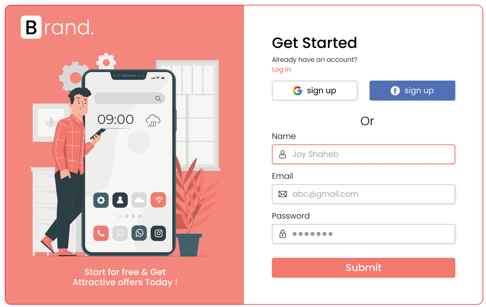

<<<<<<< HEAD
# JS form validation basic project

The goal of this project was to introduce myself to basic JavaScript form validation.
All code has been written myself but I did follow along with the article.
Bear in mind that this was not a challenge in which I had to come up with my solution.

This project was purely for educational purposes to prepare myself for the [Newsletter sign-up form with success message](https://www.frontendmentor.io/challenges/newsletter-signup-form-with-success-message-3FC1AZbNrv) challenge on [Frontend Mentor](https://www.frontendmentor.io/).

### Article information and special thanks to

- Author: [Joy Shaheb
  ](https://www.freecodecamp.org/news/author/joy/)
- Article: [Learn JavaScript Form Validation – Build a JS Project for Beginners](https://www.freecodecamp.org/news/learn-javascript-form-validation-by-making-a-form/)
=======
# JS-form-validation-basic
>>>>>>> a52fafa254dc570589af1d386f71cd714e15ea32
